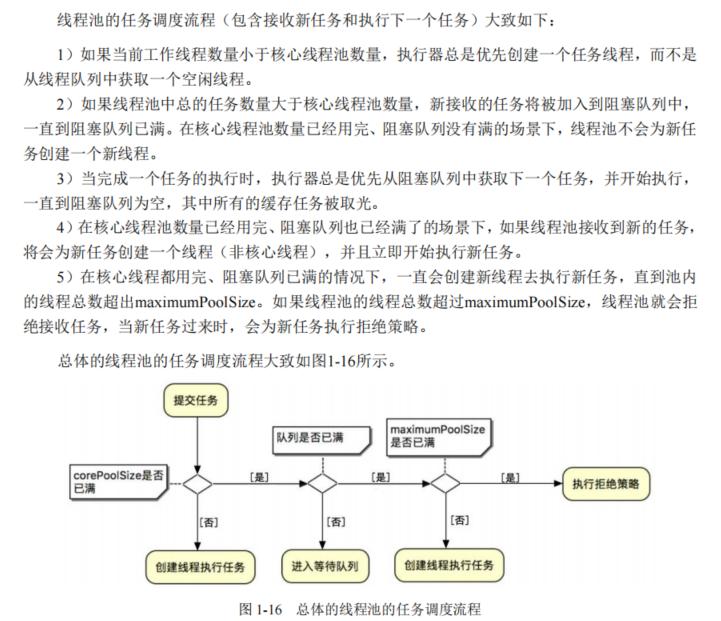

## 线程池构造器

```java
//使用标准构造器构造一个普通的线程池 
public ThreadPoolExecutor( 
    int corePoolSize, // 核心线程数，即使线程空闲（Idle），也不会回收 
    int maximumPoolSize, // 线程数的上限 
    long keepAliveTime, TimeUnit unit, // 线程最大空闲（Idle）时长 
    BlockingQueue<Runnable> workQueue, // 任务的排队队列 
    ThreadFactory threadFactory, // 新线程的产生方式 
    RejectedExecutionHandler handler) // 拒绝策略
```

## 向线程池提交任务的两种方式

- execute()方法

```
//Executor 接口中的方法 void execute(Runnable command);
```

- submit()方法

```
//ExecutorService 接口中的方法 
<T> Future<T> submit(Callable<T> task); 
<T> Future<T> submit(Runnable task, T result); 
Future<?> submit(Runnable task);
```

两者区别：

1. 二者接受的参数不同
2. submit()提交任务后会有返回值，execute没有
3. submit()方便异常处理

## 线程池的任务调度流程



## 任务阻塞队列

Java中的阻塞队列（BlockingQueue）与普通队列相比有一个重要的特点：在阻塞队列为空时，会阻塞当前线程的元素获取操作。具体来说，在一个线程从一个空的阻塞队列中获取元素时线程会被阻塞，直到阻塞队列中有了元素；当队列中有元素后，被阻塞的线程会自动被唤醒（唤醒过程不需要用户程序干预）。

BlockingQueue常见实现类：

- ArrayBlockingQueue ：一个由数组结构组成的有界阻塞队列，FIFO排序，创建时必须设置大小，如果该阻塞队列满，则会为新任务创建线程，指导线程池中线程总数大于maximumPoolSize。
- LinkedBlockingQueue ：一个由链表结构组成的有界阻塞队列，FIFO排序，可以设置容量（有界队列），如果不设置则为无界队列，该队列吞吐量高于ArrayBlockingQueue。
- PriorityBlockingQueue ：一个支持优先级排序的无界阻塞队列。
- DelayQueue：一个使用优先级队列实现的无界阻塞队列。
- SynchronousQueue：一个不存储元素的阻塞队列，每个插入操作必须等到另一个线程的调用移除操作，否则插入操作一直处于阻塞状态，其吞吐量通常高于LinkedBlockingQueue。

## 调度器的钩子方法

ThreadPoolExecutor类提供了三个钩子方法（空方法），这三个空方法一般用作被子类重写，具体如下：

```java
//任务执行之前的钩子方法（前钩子）
protected void beforeExecute(Thread t, Runnable r) { }
//任务执行之后的钩子方法（后钩子）
protected void afterExecute(Runnable r, Throwable t) { }
//线程池终止时的钩子方法（停止钩子）
protected void terminated() { }
```

## 线程池的拒绝策略

任务被拒绝有两种情况：

- 线程池已经被关闭
- 工作队列已满且maximumPoolSize已满

无论以上哪种情况任务被拒绝，线程池都会调用RejectedExecutionHandler实例的rejectedExecution()方法。RejectedExecutionHandler是拒绝策略的接口，JUC为该接口提供了以下几种实现：

- AbortPolicy：拒绝策略。
- DiscardPolicy：抛弃策略。
- DiscardOldestPolicy：抛弃最老任务策略。
- CallerRunsPolicy：调用者执行策略。
- 自定义策略

## 线程池的优雅关闭

结合shutdown()、shutdownNow()和awaitTermination()三个方法去优雅关闭一个线程池，

大致分为以下几步：

1）执行shutdown()方法，拒绝新任务的提交，并等待所有任务有序地执行完毕。

2）执行awaitTermination（long timeout,TimeUnit unit）方法，指定超时时间，判断是否已经关闭所有任务，线程池关闭完成。

3）如果awaitTermination()方法返回false，或者被中断，就调用shutDownNow()方法立即关闭线程池所有任务。

4）补充执行awaitTermination（long timeout,TimeUnit unit）方法，判断线程池是否关闭完成。如果超时，就可以进入循环关闭，循环一定的次数（如1000次），不断关闭线程池，直到其关闭或者循环结束。


